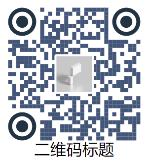

# beautify-qrcode
本项目基于NPM版QRBTF，添加了对于Icon和Title的支持，但是目前该版本没有传入NPM仓库

此项目来源于NPM版 QRBTF
URL: [npm版QRBTF](https://github.com/gexin1/beautify-qrcode)

# QRBTF

最原版
URL: [qrbtf.com](https://qrbtf.com)

中文介绍: [如何制作一个漂亮的二维码](https://mp.weixin.qq.com/s/Oy9I9FqPXhfwN9IUhf6g)


## doc

在线调试 [qrbtf.com](https://qrbtf.com)

### 使用

基本请参考：URL: [使用说明](https://github.com/gexin1/beautify-qrcode)

如何给二维码添加Icon和图标
```js
在原版options中添加了icon和title结构
{
    icon: {
        iconImg: '图片base64串'
    },
    
    title: {
        name: '二维码标题',
        // style中还可以添加其他属性，参考svg <text>标签属性
        // 【注意】style中属性的key值必须用单引号包括才可生效
        style: {
            'font-size': 3,
            'color': '#12345',
            // 其他属性参考svg <text>标签
        }
    }
}

```
示例
```js
const qrcode = encodeData({
    text: "http://www.baidu.com",
    correctLevel: 0,
});
/**
 * A1
 * @param {Object} qrcode
 * @param {Object} options
 * @param {Number} [options.type]  信息点样式 0=>矩形 1=>圆形,2=>随机
 * @param {Number} [options.size] 信息点缩放
 * @param {String} [options.opacity]  信息点不透明度
 * @param {String} [options.posType] 定位点样式 0=>矩形 1=>圆形 2=>行星
 * @param {String} [options.otherColor] 信息点颜色
 * @param {String} [options.posColor] 定位点点颜色
 * @return {String} svg图片
 */

const param = {
    type :0,
    posType: 1,
    otherColor: '#445678',
    posColor: '#223344',
    icon: {
        iconImg: defaultImage
    },
    
    title: {
        name: '二维码标题',
        // style中还可以添加其他属性，参考svg <text>标签属性
        style: {
            //【注意】style中的key必须用单引号包裹才可生效
            'font-size': 4,
            'color': '#12345',
        }
    }
}
// 传入param参数
const A1 = rendererRect(qrcode, param);


```
**效果图**


【备注】除了SP2和B1不支持外，其他二维码均可按照上述结构添加图片和标题